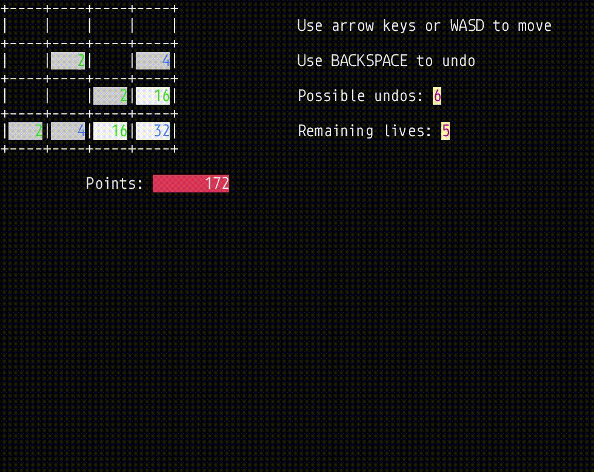

<h1 align="center">2048 Dotnet</h1>

<h4 align="center"> 
	🚧  2048 Dotnet 🚀 Under construction...  🚧
</h4> 

<hr>

<p align="center">
  <a href="#dart-about">About</a> &#xa0; | &#xa0; 
  <a href="#sparkles-features">Features</a> &#xa0; | &#xa0;
  <a href="#rocket-technologies">Technologies</a> &#xa0; | &#xa0;
  <a href="#white_check_mark-requirements">Requirements</a> &#xa0; | &#xa0;
  <a href="#checkered_flag-starting">Starting</a> &#xa0; | &#xa0;
  <a href="#memo-license">License</a> &#xa0; | &#xa0;
  <a href="https://github.com/FolkerD0C" target="_blank">Author</a>
</p>

<br>

## :dart: About ##

This project was (and still is) a learning project for me to learn to use neovim and git on the command line
and to improve my Linux knowledge. Up until commit d936c487 it was only developed in WSL2, using Ubuntu 22.04.6.

The game is simple: you need to have the tiles adding up to 2048.

## :sparkles: Features ##

:heavy_check_mark: Undo up to 7 times;\
:heavy_check_mark: 5 LIVES;\
:heavy_check_mark: Saving/Loading;


## :rocket: Technologies ##

The following tools were used in this project:

- [nvim](https://neovim.io/)
- [coc.nvim](https://github.com/neoclide/coc.nvim)
- [net6.0](https://learn.microsoft.com/en-us/dotnet/core/whats-new/dotnet-6)

## :white_check_mark: Requirements ##

Before starting :checkered_flag:, you need to have [Git](https://git-scm.com) and [dotnet](https://dotnet.microsoft.com/en-us/download/dotnet/6.0) installed.

## :checkered_flag: Starting ##

```bash
# Clone this project
$ git clone https://github.com/FolkerD0C/2048-dotnet

# Build the project
$ dotnet build 2048-dotnet/2048-dotnet.csproj

```


## :memo: License ##

This project is under license from the GNU General Public License. For more details, see the [LICENSE](LICENSE) file.


Made with :heart: by <a href="https://github.com/FolkerD0C" target="_blank">Levente Markot</a>

&#xa0;

<a href="#top">Back to top</a>
